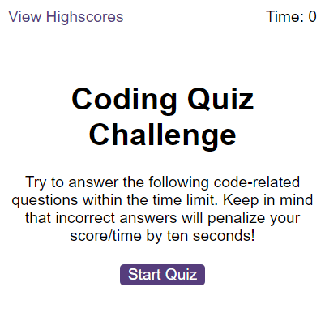
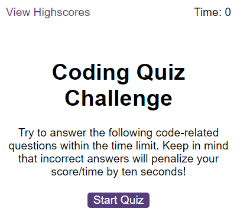
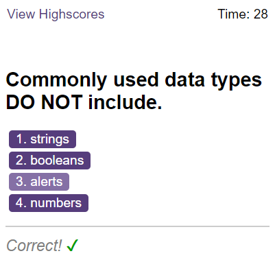
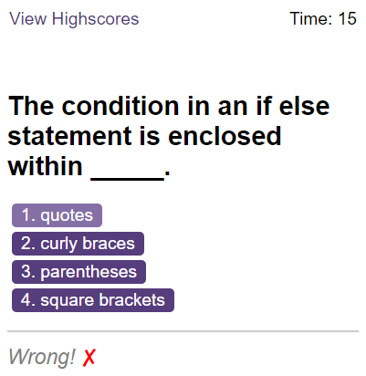
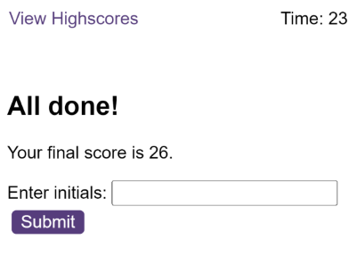
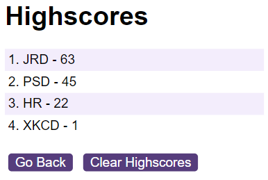

# Code Quiz Challenge

## Description

I was given the task of creating a simple, interactive coding quiz to test the users knowledge of basic JavaScript concepts.

### User Story

```
AS A coding boot camp student
I WANT to take a timed quiz on JavaScript fundamentals that stores high scores
SO THAT I can gauge my progress compared to my peers
```

### Acceptance Criteria
- A start button that when clicked a timer starts and the first question appears.
 - Questions contain buttons for each answer. 
 - When answer is clicked, the next question appears 
 - If the answer clicked was incorrect then subtract time from the clock
-The quiz should end when all questions are answered or the timer reaches 0.
 - When the game ends, it should display their score and give the user the ability to ***save*** their initials and their score

The application will be completed when all of the above criteria are met. The app will run in the browser and will feature dynamically updated HTML and CSS powered by JavaScript code. It will have a clean, polished, and responsive user interface.

## Table of contents
- [Installation](#installation)
- [Usage](#usage)
- [Credits](#credits)
- [License](#license)

## Installation
N/A

## Usage
- [Deployed Application](https://trunten.github.io/ubbc-code-quiz/)
- JavaScript is required for the site to function (make sure it is enabled).
    - noscript tag included to alert the user that JavaScript is required.
- Click the "Start" button to begin the quiz.
- Each question can be answered by clicking one of the choices presented.
- Your initials and score can be saved at the end of the quiz by entering your initials and clicking "Submit"
- Highscores can be viewed at any time by clicking the "View Highscores" link (top left of page).

Application Screenshots:

[](https://trunten.github.io/ubbc-code-quiz/)

[](https://trunten.github.io/ubbc-code-quiz/)

[](https://trunten.github.io/ubbc-code-quiz/)

[](https://trunten.github.io/ubbc-code-quiz/)

[](https://trunten.github.io/ubbc-code-quiz/)

[](https://trunten.github.io/ubbc-code-quiz/)


## Credits
- Lightbulb favicon: https://icons8.com/
- Open Graph Link preview: https://ogp.me

## License
Please refer to the [LICENSE (MIT)](LICENSE) in the repo.
